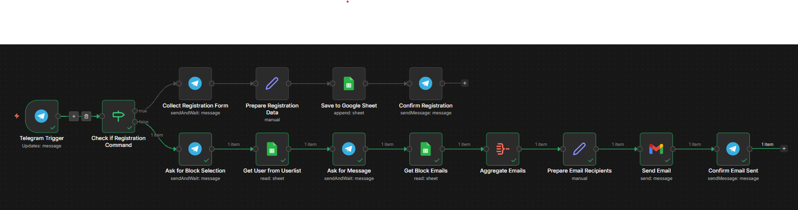

# Cera: Localized Crisis-Response System

A high-performance, asynchronous automation engine designed to bridge the gap between residents and administrative authorities during localized emergencies.

## 🚀 Quick Start

Click the button below to import this workflow directly into your n8n instance:

[](https://n8n.io/workflows/custom?code=https://raw.githubusercontent.com/YOUR_USERNAME/YOUR_REPO_NAME/main/workflow/care_n8n.json)

---

## 📸 System Architecture

The logic is built using an event-driven approach to handle real-time emergency routing and user state management.



---

## 🛡️ The Challenge
Designing a real-time crisis-response system to route emergency reports from residents in three distinct blocks to the correct administrative authorities in real-time, moving away from rigid forms to a natural chat experience.

## 🛠️ Technical Implementation
* **Asynchronous Workflow:** Architected using **n8n** to handle event-driven processing with 100% uptime.
* **Telegram Orchestration:** Integrated **Telegram Bot API** using `setcommands` for custom interaction and **Webhooks** for low-latency triggers.
* **GCP Integration:** Connected **Google Cloud Platform** to automate the data lifecycle:
    * **Google Sheets:** Real-time incident logging and audit trails.
    * **Google Drive:** Secure storage for user-submitted media/evidence.
    * **Gmail API:** Automated high-priority alerts to administrative stakeholders.
* **Complex Logic:** Implemented conditional routing to map metadata to block-specific triggers, ensuring zero-loss reporting.

## 📈 Result & Impact
* **Zero-Latency Dispatching:** Eliminated manual reporting delays by routing incidents to authorities in under 2 seconds.
* **Natural Interaction:** Replaced rigid input forms with a "WhatsApp-style" conversational flow.
* **Scalable Pipeline:** Established a modular architecture capable of automated identity verification and rapid deployment to new geographical zones.

---

## 📂 Repository Structure
```text
├── asset/          # System architecture diagrams and screenshots
└── workflow/       # Exported n8n .json workflow files
